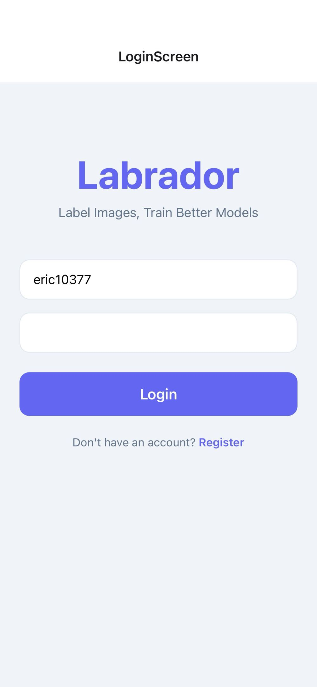
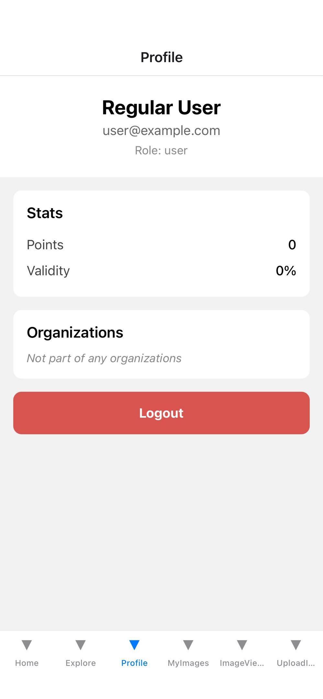
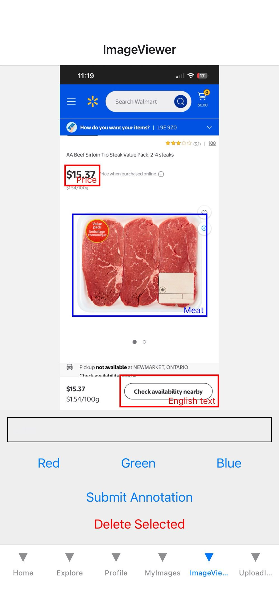
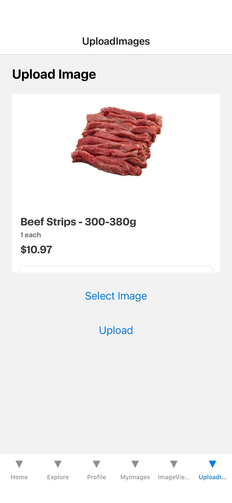
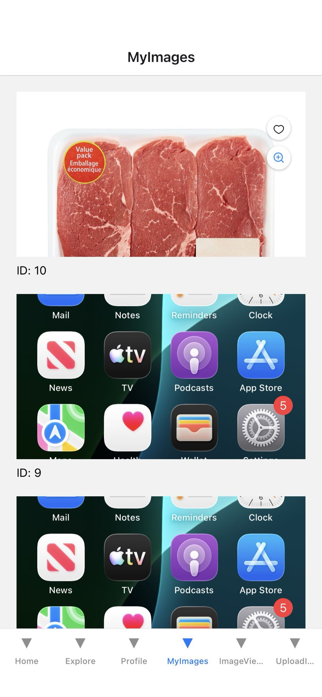

# Labrador
An app that allows users to label images and package them into containers of data for feeding into CV models.

The locally deployed app currently features:

# Login interface:


# Index and profile page:


# Image Labelling page:


# Pages to upload Images:


# Image browser to view uploaded images:



## To run locally, do the following:

## Setup & Run

### 1. Clone the repository
```bash
git clone https://github.com/cxwang1037738928/Labrador.git
cd project_root
```

### 2. Start the backend
```bash
cd backend
npm run dev
```

### 3. Start the mobile app (in a new terminal)
```bash
cd mobile_app
npx expo start
```

***Backend API Endpoints Specifications***: 

https://docs.google.com/document/d/1x6flMz_3ke3tCsHbPocF-EyskV64FF6vmhyd98thgDw/edit?usp=sharing

